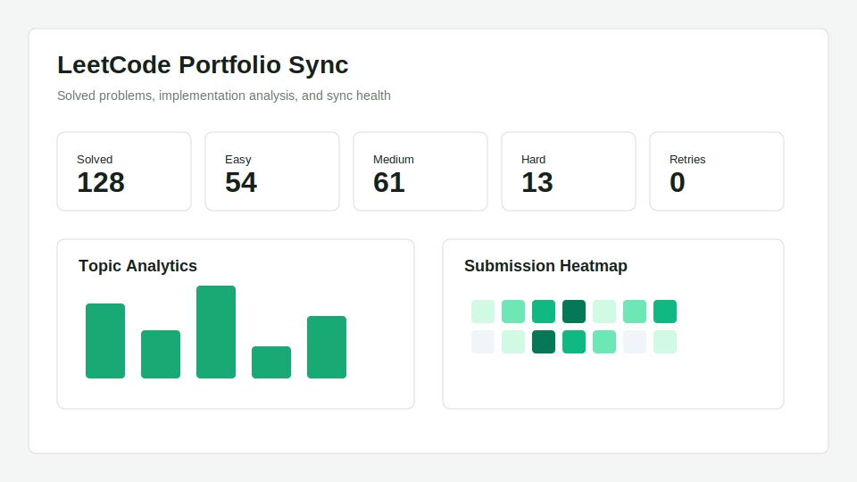
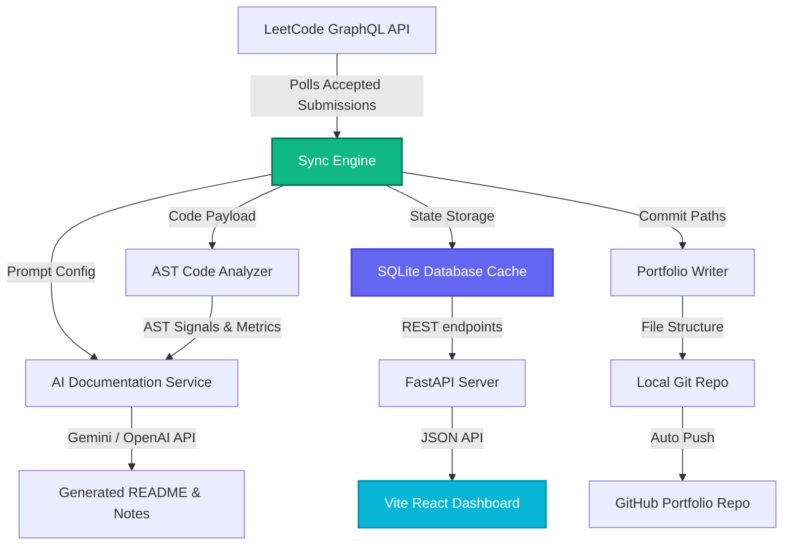

# Leet Sync 🚀

<div align="center">
  

  <p align="center">
    <strong>Automatically sync accepted LeetCode submissions to a premium GitHub portfolio with AST-based static code analysis, AI-generated documentation, and an interactive React dashboard.</strong>
  </p>

  <p align="center">
    <a href="https://github.com/example/leetcode-portfolio-sync/actions"></a>
    <a href="#"></a>
    <a href="#"></a>
    <a href="#"></a>
    <a href="LICENSE"></a>
  </p>
</div>

---

## 🌟 Introduction

Leet Sync is a developer-focused, open-source automation utility that watches your LeetCode profile, fetches accepted solutions, and builds a comprehensive, beautiful GitHub portfolio repository. Unlike simple extensions that just dump code, Leet Sync runs a complete static AST analysis on your code to determine patterns and uses advanced AI models to generate professional documentation, explanations, complexity justifications, and interactive revision notes.

---

## ⚡ Features Comparison Table

Here is how Leet Sync compares to alternative extensions and tools:

| Feature | Leet Sync | Standard Browser Extensions (e.g. LeetHub) | Manual Commits |
| :--- | :---: | :---: | :---: |
| **Automatic Submission Sync** | **Yes** (FastAPI Daemon/GraphQL API) | Yes (Browser Extension only) | No |
| **AST Code Analysis** | **Yes** (Loops, branches, recursion, patterns) | No | No |
| **AI Documentation Generation** | **Yes** (Gemini/OpenAI/Deterministic) | No | No |
| **Interactive Analytics Dashboard** | **Yes** (Vite + React + Tailwind + Recharts) | No | No |
| **Offline Recovery Queue** | **Yes** (SQLite local storage + Retries) | No | No |
| **Custom Git Commits** | **Yes** (Template-driven formats) | No | Yes |
| **Language & Topic Indexes** | **Yes** (Auto-regenerating markdown indexes) | No | No |

---

## 🧱 Architecture Diagram



---

## 🚦 Quick Start

### 1. Installation

```powershell
# Clone the repository
git clone https://github.com/yourusername/leetcode-portfolio-sync.git
cd leetcode-portfolio-sync

# Install package with development dependencies
python -m pip install -e ".[dev]"
```

### 2. Configuration

Copy the example configuration files and add your secrets to `.env`:

```powershell
copy .env.example .env
copy config.example.yaml config.yaml
```

Update your `.env` with:
- `LEETCODE_SESSION`: Your LeetCode session cookie.
- `LEETCODE_CSRF_TOKEN`: Your LeetCode CSRF token.
- `GITHUB_TOKEN`: Your GitHub personal access token.
- `GEMINI_API_KEY` or `OPENAI_API_KEY`: If using AI-generated documentation.

### 3. Run the Sync Daemon

```powershell
# Sync last 20 submissions
leetcode-portfolio-sync sync-recent your_leetcode_username --limit 20

# Run in background daemon watch mode
leetcode-portfolio-sync watch your_leetcode_username
```

### 4. Open the Analytics Dashboard

```powershell
cd dashboard
npm install
npm run dev
```

---

## 📅 Roadmap

- [x] SQLite local caching for instant statistics rendering
- [x] AST code parsing to detect dynamic programming, graphs, and two-pointer patterns
- [x] AI-driven explanation builder (Gemini/OpenAI integration)
- [ ] Support for other coding platforms (HackerRank, Codeforces, CodeWars)
- [ ] VS Code Extension for real-time portfolio management directly from the editor
- [ ] Dockerized single-click deployment config

---

## ❓ FAQ

### Q: Does this require keeping my LeetCode password?
No. Leet Sync works entirely using session cookies (`LEETCODE_SESSION` and `LEETCODE_CSRF_TOKEN`). Your credentials are never stored.

### Q: Can I run this without paying for LLM APIs?
Absolutely! By default, Leet Sync uses a `deterministic` generator that parses AST signals to construct an elegant README without hitting any LLM. Simply set `documentation.provider` to `deterministic` in your `config.yaml`.

---

## 🤝 Contributing

Contributions are welcome! If you have suggestions or bug fixes, feel free to open an issue or submit a pull request.

Please review our [CONTRIBUTING.md](CONTRIBUTING.md) and run validation checks before contributing:
```powershell
# Run code formatters and checkers
ruff check src tests
black --check src tests
mypy src

# Run tests
pytest
```
