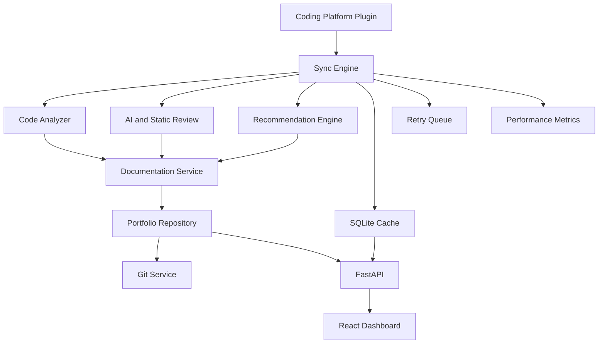

# Architecture

The application is organized around small services:

- `LeetCodeClient` retrieves accepted submissions, submission details, and problem metadata.
- `CodingPlatform` defines the plugin contract for LeetCode and future platforms.
- `CodeAnalyzer` performs AST and heuristic analysis of accepted code.
- `CodeReviewService` performs AI review when configured and deterministic static review as a fallback.
- `RecommendationEngine` chooses related LeetCode practice problems from tags and detected patterns.
- `DocumentationService` delegates to OpenAI, Gemini, or deterministic generation.
- `PortfolioRepository` writes problem folders, metadata, stats, topic indexes, and difficulty indexes.
- `GitService` stages, commits, pushes, creates repositories, and queues failed pushes.
- `SQLiteCache` stores fetched submissions, generated sync events, and reusable metadata locally.
- `RetryQueue` persists failed sync operations for later replay.
- `PerformanceMetrics` records timings and counters for sync operations.
- `SyncEngine` coordinates the workflow.
- FastAPI exposes stats and sync operations for the React dashboard.

All production paths use explicit dependencies so tests can inject fakes without network access.

## Code Analysis

Python submissions use `ast` to identify function calls, assignments, loops, branches,
recursion, data structures, and algorithmic patterns. Other languages use a conservative
token-based analyzer. The analysis output is stored in `metadata.json` and passed into
documentation generation.

## Reliability

Network fetches use retry-aware HTTP sessions. Failed sync operations are stored in a
local retry queue and sync events are written to SQLite. Logs are emitted as structured
JSON by default.
